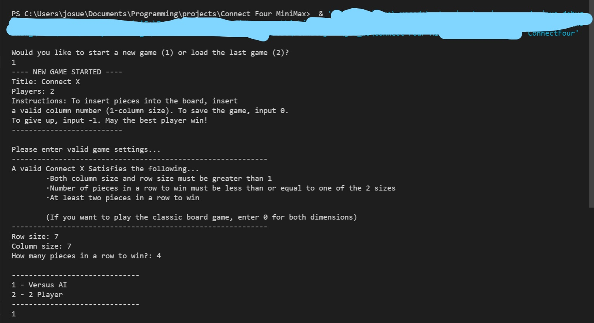
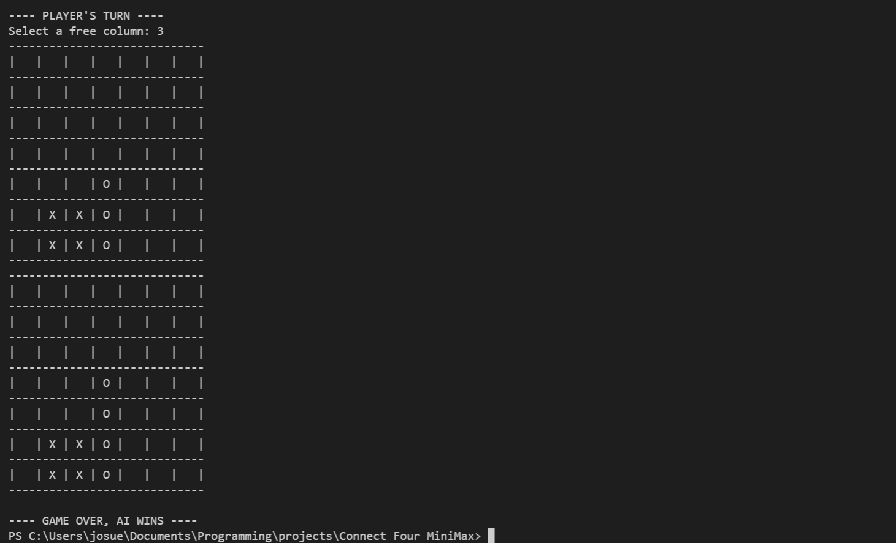

# Connect Four in Java with Mini Max AI
> Academic Project undertaken as part of University Course

## Table of Contents
* [General Info](#general-information)
* [Technologies Used](#technologies-used)
* [Features](#features)
* [Screenshots](#screenshots)
* [Setup](#setup)
* [Usage](#usage)
* [Project Status](#project-status)
* [Room for Improvement](#room-for-improvement)
* [Contact](#contact)
<!-- * [License](#license) -->

## General Information
- Java console version of classic Connect Four game
- Implemented using Model-View-Controller architecture
- MiniMax algorithm implementation for AI player
- Undertaken as part of university course, but enhanced with features such as the MiniMax algorithm

## Technologies Used
- Java - version 1.8.0_301

## Features
The Java Connect Four Console App has the following features...
- Working game logic, including diagonal win checks
- Custom game parameters, including resizable grid
- Option to play against another player or against the AI

## Screenshots

## Setup
Make sure JDK v11 is installed on your machine and then run the `ConnectFour.java` file

## Usage
Run `ConnectFour.java` file

## Project Status
Project is: _complete_

## Room for Improvement

Room for improvement:
- Add a GUI for this project
- Improve the AI algorithm

To do:
- Add GUI for the project

## Contact
Created by [@josflesan](https://www.github.com/josflesan/) - feel free to contact me!
